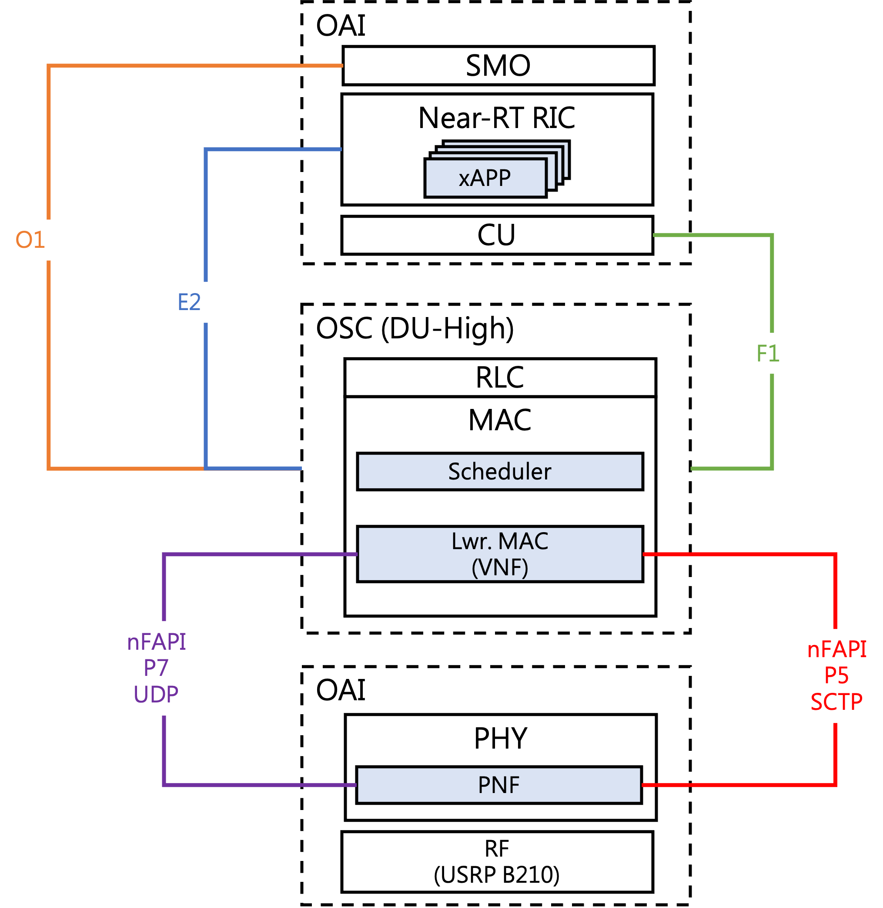

# Small Cell Integration Project
This is the small cell integration project based on [OSC_DU_High_Rel-H](https://docs.o-ran-sc.org/projects/o-ran-sc-o-du-l2/en/latest/overview.html)


## Architecture


The nFAPI is the network interface between DU-High and OAI pnf.

The main design of our work focuses on the VNF and scheduler embedded in MAC layer in DU.

## Installation
* In this work, the flag `NFAPI=YES` must be set.

1. Complilation
```sh
cd l2/build/odu
#clean
make clean_odu MACHINE=BIT64 MODE=FDD NFAPI=YES
make clean_cu MACHINE=BIT64 MODE=FDD NFAPI=YES
make clean_ric MACHINE=BIT64 MODE=FDD NFAPI=YES

#compile
make odu MACHINE=BIT64 MODE=FDD NFAPI=YES
make cu_stub NODE=TEST_STUB MACHINE=BIT64 MODE=FDD NFAPI=YES
make ric_stub NODE=TEST_STUB MACHINE=BIT64 MODE=FDD NFAPI=YES
```

2. Execution

**Follow the OCS-DU High guidence**

## [Change Log](./CHANGELOG.md)


## Note

## Contributor
* Yu-Hsin Chuang

